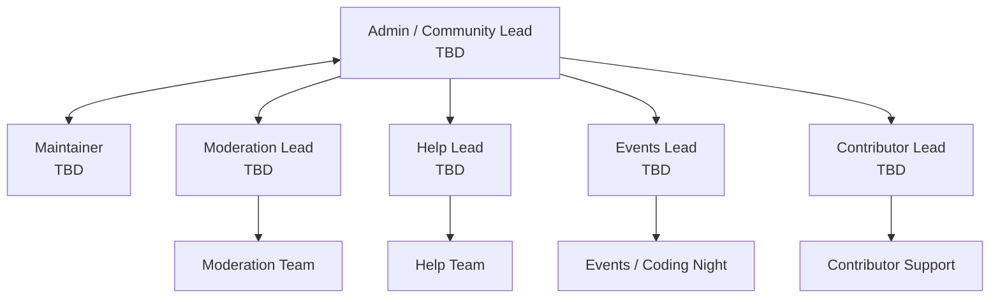

Hi! This repository is our workspace for documenting how the OpenSRE Discord server is run.
It's written from the perspective of the leads, but is open source for transparency.

This is a living document, anything can and will be changed at any time without warning. The only exception is the Rules, which will have changes announced in the #announcements channel within the server.
If you think that something should be changed in our policies, feel free to open a GitHub issue here on this repo.

**This repository is not the place to appeal moderation actions or report a moderator. This is solely to house and discuss our policies.** If you want to appeal a moderation action or report a moderator, please use the form at `<TBD: appeals URL>`.

# Table of Contents

- [Mod Onboarding](onboarding.md)
- [Moderation Guide](moderation.md)
- [Rules (Mirror)](rules.md)
- [Roles Reference](roles.md)
- [Incident Playbook](incident-playbook.md)
- [Security Policy](SECURITY.md)
- [Contributing Guidelines](CONTRIBUTING.md)
- [First Contribution / Getting Started](FIRST_CONTRIBUTION.md)
- [Code of Conduct](CODE_OF_CONDUCT.md)

# Community Staff Structure

Community Staff is the volunteer team that supports OpenSRE's community spaces. Staff help with moderation, support, events, and community operations. The Admin owns final decisions, policy updates, staffing, and escalations, but will often ask the leads for input before making major decisions.

Community Staff is not split into separate teams. Instead, there are areas of responsibility that Community Staff work on together, with leads responsible for coordination and final direction in each area. Staff may help across areas as needed.

## Hierarchy

## Areas of Responsibility

### Maintainer

- Works alongside the Admin on community coordination, planning, and staffing decisions.
- Also carries moderator responsibilities, including rule enforcement in text and voice channels.
- Acts as an escalation point for Community Staff when the Admin is unavailable.

### Moderation

- Owns rule enforcement across Discord text and voice spaces.
- Handles general moderation, thread hygiene, member guidance, and incident response.
- Coordinates with staff working in the help area when a support issue appears in general chat.

### Help

- Owns support channels such as #help and #users-helping-users.
- Handles OpenSRE product/tool questions and triage.
- Escalates bugs, account issues, or unclear cases to the Admin or relevant lead.

### Events

- Owns recurring community events, including Coding Night (twice-weekly live coding sessions).
- Coordinates event presenters, recordings, and event chat/community experience.
- Works with the Admin before launching new official outreach or event programs.

### Contributor Support

- Owns #contribute and related contributor channels.
- Helps members working on assigned GitHub issues unblock themselves.
- Reviews contributor role claim requests where applicable.

## Elevated Permissions

These are not areas of responsibility or separate teams. They are extra permissions granted to specific staff who need them.

### Bot Managers

- Maintain bot dashboards, bot configuration, automod settings, and operational tooling.
- Coordinate with the Admin and relevant lead before changes that affect member experience.

### GitHub Moderators

- Handle moderation needs on GitHub when maintainers or community staff escalate an issue.
- Use #github-moderation for coordination.

## Backup Discord Server

`<TBD: backup invite URL>`

A backup server is kept as a public fallback in case the main server is unavailable. The backup server is not intended to replace the main community during normal operations.

# Current Leads

### Admin / Community Lead: TBD
- Discord: `<TBD>`
- Email: `<TBD>`

### Maintainer: TBD
- Discord: `<TBD>`

### Moderation Lead: TBD
- Discord: `<TBD>`

### Help Lead: TBD
- Discord: `<TBD>`

### Events Lead: TBD
- Discord: `<TBD>`

### Contributor Lead: TBD
- Discord: `<TBD>`

# Applying

We accept staff applications by email. Send a short, **__human-written__** note to `<TBD: applications email>` with the details below.

**Subject:** `Staff application – <your Discord handle>`

**Include:**
- **Experience:** moderation, community leadership, support, or ops experience (links welcome).
- **Handles:** Discord, GitHub, X (Twitter), plus your best contact email.
- **Availability:** timezone + typical hours/week.
- **Preferred area(s):** moderation, help, events, contributor support, bots, GitHub moderation, or another area you want to help with.
- **Recommendation(s):** who can vouch for you, and how to contact them.
- **Extras:** languages, prior OpenSRE involvement, or relevant projects.

We'll follow up (generally via Discord) if there's a fit or we need more info.
